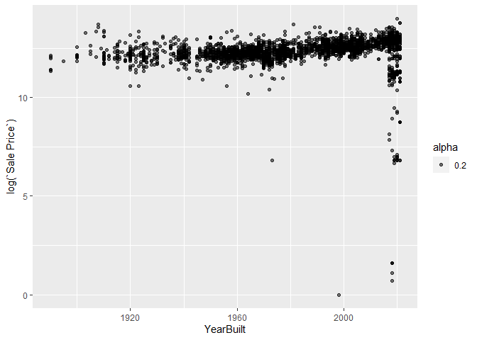
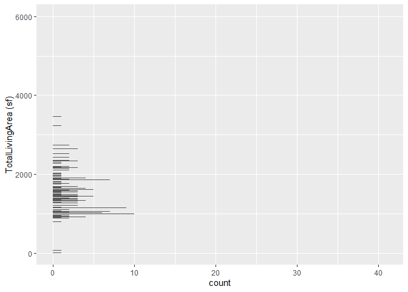
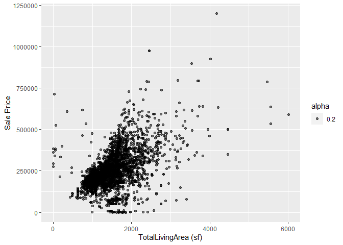
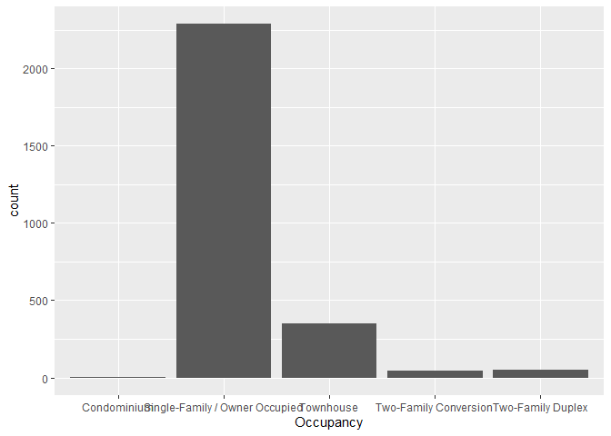
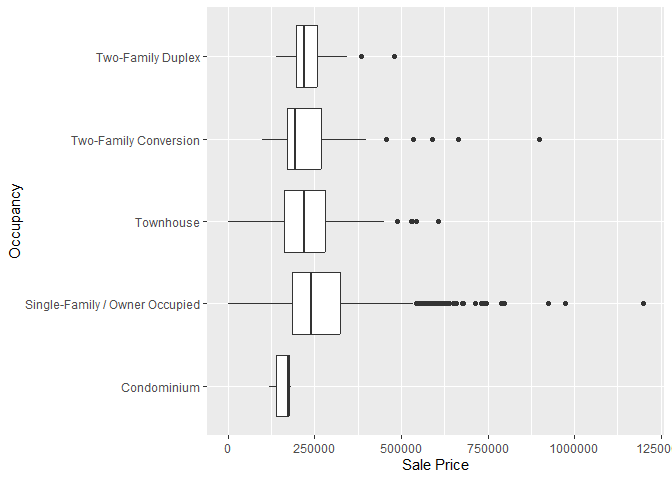

<!-- README.md is generated from README.Rmd. Please edit the README.Rmd file -->

# Lab report \#1

**TL;DR** Sales price is the most important variable, and follows a
linear relationship with Total Living Area. Acres and Sales Price also
follow a linear relationship, albeit with a much lower strength.

Follow the instructions posted at
<https://ds202-at-isu.github.io/labs.html> for the lab assignment. The
work is meant to be finished during the lab time, but you have time
until Monday evening to polish things.

Include your answers in this document (Rmd file). Make sure that it
knits properly (into the md file). Upload both the Rmd and the md file
to your repository.

All submissions to the github repo will be automatically uploaded for
grading once the due date is passed. Submit a link to your repository on
Canvas (only one submission per team) to signal to the instructors that
you are done with your submission.

1.  Inspect the first few lines of the data set. What variables are
    there? Of what type are the variables? What does each variable mean?
    What do we expect their data range to be?

``` r
library(classdata)
library(ggplot2)
library(dplyr)
```

    ## 
    ## Attaching package: 'dplyr'

    ## The following objects are masked from 'package:stats':
    ## 
    ##     filter, lag

    ## The following objects are masked from 'package:base':
    ## 
    ##     intersect, setdiff, setequal, union

``` r
df = ames %>% filter(YearBuilt!=0) %>% filter(`LotArea(sf)`!=0) %>% filter(Acres!=0) %>% filter(`TotalLivingArea (sf)`!=0) %>% filter(`Sale Price`!=0) %>% filter(Bedrooms!=0) %>% filter(Acres!=0) %>% filter(`TotalLivingArea (sf)`!=0) %>% filter(`Bedrooms` != 0) %>% filter(`FinishedBsmtArea (sf)`!=0) %>% filter(AC != 0) %>% filter(FirePlace != 0) %>% filter(Neighborhood != 0)
ames = df
summary(ames)
```

    ##   Parcel ID           Address                        Style     
    ##  Length:2738        Length:2738        1 Story Frame    :1569  
    ##  Class :character   Class :character   2 Story Frame    : 637  
    ##  Mode  :character   Mode  :character   1 1/2 Story Frame: 237  
    ##                                        Split Level Frame: 126  
    ##                                        Split Foyer Frame: 106  
    ##                                        1 Story Brick    :  28  
    ##                                        (Other)          :  35  
    ##                           Occupancy      Sale Date            Sale Price     
    ##  Condominium                   :   5   Min.   :2017-07-03   Min.   :      1  
    ##  Single-Family / Owner Occupied:2289   1st Qu.:2019-01-30   1st Qu.: 180800  
    ##  Townhouse                     : 347   Median :2020-07-23   Median : 235000  
    ##  Two-Family Conversion         :  46   Mean   :2020-04-11   Mean   : 257205  
    ##  Two-Family Duplex             :  51   3rd Qu.:2021-07-19   3rd Qu.: 317000  
    ##                                        Max.   :2022-08-31   Max.   :1200000  
    ##                                                                              
    ##   Multi Sale          YearBuilt        Acres       TotalLivingArea (sf)
    ##  Length:2738        Min.   :1890   Min.   :0.024   Min.   :   3        
    ##  Class :character   1st Qu.:1960   1st Qu.:0.184   1st Qu.:1146        
    ##  Mode  :character   Median :1979   Median :0.228   Median :1498        
    ##                     Mean   :1980   Mean   :0.266   Mean   :1547        
    ##                     3rd Qu.:2005   3rd Qu.:0.285   3rd Qu.:1793        
    ##                     Max.   :2021   Max.   :4.650   Max.   :6007        
    ##                                                                        
    ##     Bedrooms      FinishedBsmtArea (sf)  LotArea(sf)          AC           
    ##  Min.   : 1.000   Min.   :  16.0        Min.   :  1037   Length:2738       
    ##  1st Qu.: 3.000   1st Qu.: 480.0        1st Qu.:  8020   Class :character  
    ##  Median : 4.000   Median : 725.0        Median :  9912   Mode  :character  
    ##  Mean   : 3.575   Mean   : 766.2        Mean   : 11585                     
    ##  3rd Qu.: 4.000   3rd Qu.:1000.0        3rd Qu.: 12400                     
    ##  Max.   :10.000   Max.   :2537.0        Max.   :202554                     
    ##                                                                            
    ##   FirePlace                            Neighborhood 
    ##  Length:2738        (27) Res: N Ames         : 423  
    ##  Class :character   (37) Res: College Creek  : 368  
    ##  Mode  :character   (19) Res: North Ridge Hei: 184  
    ##                     (34) Res: Edwards        : 183  
    ##                     (26) Res: NW Ames        : 138  
    ##                     (31) Res: Mitchell       : 132  
    ##                     (Other)                  :1310

``` r
head(ames)
```

    ## # A tibble: 6 × 16
    ##   `Parcel ID` Address      Style Occupancy `Sale Date` `Sale Price` `Multi Sale`
    ##   <chr>       <chr>        <fct> <fct>     <date>             <dbl> <chr>       
    ## 1 0923203160  3404 EMERAL… 1 St… Townhouse 2022-08-09        245000 <NA>        
    ## 2 0531363050  5426 KANSAS… 1 St… Single-F… 2022-08-03        242000 <NA>        
    ## 3 0534128100  1607 PIERCE… 2 St… Single-F… 2022-08-03        293000 <NA>        
    ## 4 0527354040  2006 POLK D… 1 St… Single-F… 2022-08-19        341100 <NA>        
    ## 5 0533252180  2835 TORREY… 1 St… Single-F… 2022-08-18        515000 <NA>        
    ## 6 0527454090  1107 JOHNSO… 1 St… Townhouse 2022-08-11        205000 <NA>        
    ## # ℹ 9 more variables: YearBuilt <dbl>, Acres <dbl>,
    ## #   `TotalLivingArea (sf)` <dbl>, Bedrooms <dbl>,
    ## #   `FinishedBsmtArea (sf)` <dbl>, `LotArea(sf)` <dbl>, AC <chr>,
    ## #   FirePlace <chr>, Neighborhood <fct>

``` r
str(ames)
```

    ## tibble [2,738 × 16] (S3: tbl_df/tbl/data.frame)
    ##  $ Parcel ID            : chr [1:2738] "0923203160" "0531363050" "0534128100" "0527354040" ...
    ##  $ Address              : chr [1:2738] "3404 EMERALD DR, AMES" "5426 KANSAS DR, AMES" "1607 PIERCE CIR, AMES" "2006 POLK DR, AMES" ...
    ##  $ Style                : Factor w/ 12 levels "1 1/2 Story Brick",..: 5 5 9 5 5 5 9 9 9 11 ...
    ##  $ Occupancy            : Factor w/ 5 levels "Condominium",..: 3 2 2 2 2 3 2 2 2 2 ...
    ##  $ Sale Date            : Date[1:2738], format: "2022-08-09" "2022-08-03" ...
    ##  $ Sale Price           : num [1:2738] 245000 242000 293000 341100 515000 ...
    ##  $ Multi Sale           : chr [1:2738] NA NA NA NA ...
    ##  $ YearBuilt            : num [1:2738] 1997 2004 1972 1988 2015 ...
    ##  $ Acres                : num [1:2738] 0.103 0.172 0.297 0.239 0.325 0.057 0.143 0.23 0.237 0.251 ...
    ##  $ TotalLivingArea (sf) : num [1:2738] 1289 1158 1429 1872 1696 ...
    ##  $ Bedrooms             : num [1:2738] 4 4 4 3 4 2 3 4 4 4 ...
    ##  $ FinishedBsmtArea (sf): num [1:2738] 890 500 593 929 858 711 404 580 143 938 ...
    ##  $ LotArea(sf)          : num [1:2738] 4500 7500 12936 10400 14162 ...
    ##  $ AC                   : chr [1:2738] "Yes" "Yes" "Yes" "Yes" ...
    ##  $ FirePlace            : chr [1:2738] "No" "No" "Yes" "Yes" ...
    ##  $ Neighborhood         : Factor w/ 42 levels "(0) None","(13) Apts: Campus",..: 18 23 13 13 8 27 17 10 17 22 ...

``` r
class(df$Acres)
```

    ## [1] "numeric"

``` r
min(df$Acres)
```

    ## [1] 0.024

``` r
max(df$Acres)
```

    ## [1] 4.65

``` r
class(df$`TotalLivingArea (sf)`)
```

    ## [1] "numeric"

``` r
min(df$`TotalLivingArea (sf)`)
```

    ## [1] 3

``` r
max(df$`TotalLivingArea (sf)`)
```

    ## [1] 6007

``` r
class(df$Bedrooms)
```

    ## [1] "numeric"

``` r
min(df$Bedrooms)
```

    ## [1] 1

``` r
max(df$Bedrooms)
```

    ## [1] 10

``` r
class(df$`FinishedBsmtArea (sf)`)
```

    ## [1] "numeric"

``` r
min(df$`FinishedBsmtArea (sf)`)
```

    ## [1] 16

``` r
max(df$`FinishedBsmtArea (sf)`)
```

    ## [1] 2537

``` r
class(df$`LotArea(sf)`)
```

    ## [1] "numeric"

``` r
min(df$`LotArea(sf)`)
```

    ## [1] 1037

``` r
max(df$`LotArea(sf)`)
```

    ## [1] 202554

``` r
class(df$AC)
```

    ## [1] "character"

``` r
min(df$AC)
```

    ## [1] "No"

``` r
max(df$AC)
```

    ## [1] "Yes"

``` r
class(df$FirePlace)
```

    ## [1] "character"

``` r
min(df$FirePlace)
```

    ## [1] "No"

``` r
max(df$FirePlace)
```

    ## [1] "Yes"

``` r
class(df$Neighborhood)
```

    ## [1] "factor"

The variables of the data set are: Parcel ID, Address, Style, Occupancy,
Sale Date, Sale Price, Multi Sale, YearBuilt, Acres, TotalLivingArea
(sf), Bedrooms, FinishedBsmtArea (sf), LotArea(sf), AC, FirePlace, and
Neighborhood. That makes 17 variables, and we removed the rows with
strange values of 0 for certain variables. Parcel ID is of type chr, and
is a 10 digit number providing a unique ID to each residence. Address is
of type chr, and is a string representing the location of the residence.
Style is of type Factor, and represents the general size of the
residence in stories. Occupancy is of type Factor, and represents the
type of residence, such as Townhouse or Condominium. Sale date is of
type date, represents the date the residence was sold, and go from
2017-07-03 to 2022-08-31. Sale price is of type num, represents the USD
cost of the residence, and ranges from \$1 to \$20,500,000. Multi Sale
is of type chr, and represents if the residence sale occurred with
others. Most of these values are NA. YearBuilt is of type num,
represents the year the residence was built, and ranges from 1880 to
2021.

Acres represents the acerage of the properties, is of type ‘double’ and
ranges from 0.001 to 4.65. TotalLivingArea represents the living area of
the properties, is of type ‘double’ and ranges from 3 to 6007 sf.
Bedrooms represents the number of bedrooms per property, is of type
‘double’, and ranges from 1 to 10. FinishedBsmtArea represents the
basement area of each property, is of type ‘double’, and ranges from 16
to 2537 sf. LotArea represents the lot area of each property, is of type
‘double’, and ranges from 1037 to 202554. AC represents whether or not
there is an AC in the property, is of type ‘character’, and is either No
or Yes. Fireplace represents whether or not there is a fireplace on the
property, is of type ‘character’, and is either Yes or No. Neighborhood
represents the neighborhood of the property and is of type ‘factor’.

2.  Is there a variable of special interest or focus?

For this model, We are focusing on Sale Price.

3.  Start the exploration with the main variable. What is the range of
    the variable? Draw a histogram for a numeric variable or a bar
    chart, if the variable is categorical. What is the general pattern?
    Is there anything odd? Follow up on any oddities in step 4.

``` r
min(ames$'Sale Price')
```

    ## [1] 1

``` r
max(ames$'Sale Price')
```

    ## [1] 1200000

``` r
options(scipen = 999) # Option to prevent scientific notation
ggplot(ames, aes(x = `Sale Price`)) +
  geom_histogram(bins = 30) +
  labs(title = "Histogram of Sale Price",
       x = "Sale Price",
       y = "Frequency")
```

<!-- -->

``` r
options(scipen = 0) # Resetting option to default
```

The main variable “Sale Price” ranges from 1 to 20.5 million dollars.
When looking at a histogram of “Sale Price”, we see that the
overwhelming majority of the data is contained within the first three
bins, and the rest of the data is contained within two bins on the
higher side of the range of “Sale Price”. It is odd that there are so
many possible values for “Sale Price” that don’t have any observations
to match, leaving us with a lot of empty space in the plot.

4.  Pick a variable that might be related to the main variable. What is
    the range of that variable? Plot/describe the pattern. What is it’s
    relationship to the main variable? Plot a scatterplot, boxplot, or
    faceted barcharts (depending on the types of variables involved).
    Describe overall pattern, does this variable describe any oddities
    discovered in 3? Identify/follow-up on any oddities.

Niraj: I am choosing the YearBulit variable as my secondary variable to
explore with sales variable.

Range of the YearBuild:

``` r
# library(tidyverse)
# library(ggplot2)

range(as.numeric(as.character(ames$YearBuilt)), na.rm = TRUE)
```

    ## [1] 1890 2021

``` r
ggplot(data = ames, aes(x = factor(YearBuilt), weight = `Sale Price`))  + geom_bar() + labs(x = 'Year Built') + coord_flip()
```

<!-- -->

Relationship with the Main Variale( sale price):

``` r
ggplot(data = ames, aes(x = YearBuilt, y = log(`Sale Price`), alpha = 0.2)) +
  geom_point()
```

<!-- -->

Vinayak: I am doing the TotalLivingArea (sf) The range of this variable
is:

``` r
max(ames$`TotalLivingArea (sf)`, na.rm = TRUE)
```

    ## [1] 6007

``` r
min(ames$`TotalLivingArea (sf)`, na.rm = TRUE)
```

    ## [1] 3

``` r
ggplot(ames, aes(x = `TotalLivingArea (sf)`)) + geom_bar() + coord_flip()
```

<!-- -->

Relationship to the main variable:

``` r
ggplot(data = ames, aes(x = `TotalLivingArea (sf)`, y = `Sale Price`, alpha = 0.2)) + geom_point()
```

<!-- -->

Sale Price increases as Total Living Area increases, we see that there
are few properties with a living area above 4000 sf, and there is only
one property above \$1000000. Most properties an area of fewer than 2000
sf. Sale Price and TotalLivingArea have a mostly linear relationship.
There aren’t any oddities between Sale Price and TotalLivingArea.

Zane: I am choosing the Acres variable.

``` r
max(ames$Acres, na.rm=TRUE)
```

    ## [1] 4.65

``` r
min(ames$Acres, na.rm=TRUE)
```

    ## [1] 0.024

``` r
mean(ames$Acres, na.rm=TRUE)
```

    ## [1] 0.2660073

``` r
ggplot(ames, aes(x = Acres)) + 
  geom_histogram(binwidth=0.1) +
  ggtitle("binwidth = 0.1")
```

<!-- -->

The distribution is heavily skewed right, with a minimum of 0.024 acres
and a maximum of 4.65 acres. The mean acreage is 0.266.

``` r
ggplot(ames, aes(x = Acres, y = `Sale Price`, alpha = 0.2)) +
  geom_point()
```

<!-- -->

The majority of the residences in the scatterplot are clustered with low
acreage and low to medium price. There is no clear correlation due to
the extreme density of points. However, we can tell that there is a
positive correlation between acreage and sale price.There are no obvious
oddities between acreage and sale price.

Ryan: I will look at Occupancy.

``` r
summary(ames$Occupancy)
```

    ##                    Condominium Single-Family / Owner Occupied 
    ##                              5                           2289 
    ##                      Townhouse          Two-Family Conversion 
    ##                            347                             46 
    ##              Two-Family Duplex 
    ##                             51

There are 5 levels to this categorical variable: Condominium, Townhouse,
Two-Family Duplex, Single-Family/Owner Occupied, Two-Family Conversion.

``` r
ggplot(data = ames, aes(x = Occupancy)) +
  geom_bar()
```

<!-- -->

The vast majority of observations fall under Single-Family/Owner
Occupied; fewer but still many observations are either Condominium or
Townhouse; similarly few observations are Two-Family Conversion or
Two-Family Duplex.

``` r
options(scipen = 999)
ggplot(data = ames) +
  geom_boxplot(mapping = aes(x = `Sale Price`, y = Occupancy))
```

<!-- -->

``` r
options(scipen = 0)
```

Condominiums clearly contain the data points at the highest end of the
range. Since the extreme relative values of Sale Price cause the other
levels of Occupancy to lose a distinct shape, it’s worth looking at an
adjusted box plot to get a sense of the pattern.

``` r
options(scipen = 999)
ggplot(data = ames) +
  geom_boxplot(mapping = aes(x = log(`Sale Price`), y = Occupancy)) +
  labs(x = "Log of Sale Price")
```

<!-- -->

``` r
options(scipen = 0)
```

While applying a log transformation to Sale Price isn’t perfect, it
allows us to at least see the pattern in Occupancy’s effect on Sale
Price. In order from least to greatest median log Sale Price we have:
Two-Family Conversion, Two-Family Duplex and Townhouse roughly
equivalent, Single-Family/Owner Occupied, and finally Condominium. While
the levels of Occupancy (apart from Condominium) don’t seem to differ
drastically in their effects on Sale Price, there is a small effect
worth considering.
